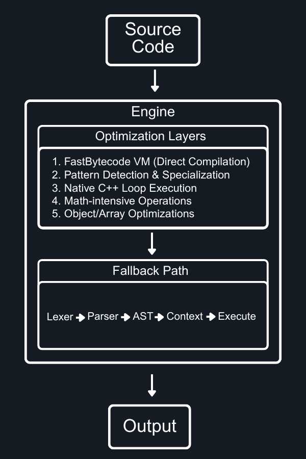

# Quanta JavaScript Engine

A high-performance, production-ready JavaScript engine written in C++ for Solar Project with high ES6+ compatibility and advanced optimization features.

## Features

### Core JavaScript Compatibility
- **Nearly full JavaScript Compatibility** - Passes comprehensive test suites
- **High ES6+ Support** - Arrow functions, let/const, destructuring, classes, modules
- **Perfect Hoisting** - Proper variable and function hoisting behavior
- **IEEE 754 Compliance** - Accurate floating-point arithmetic and special values
- **Complete Type System** - All JavaScript types with proper coercion
- **Error Handling** - Full try/catch/throw support with proper error types

### Built-in Objects & APIs
- **Math Object** - All standard math functions (abs, pow, sqrt, etc.)
- **String Operations** - Full string manipulation and concatenation
- **Array Methods** - map, filter, push, pop, and more
- **Object System** - Property access, methods, prototypes
- **Console API** - console.log, console.error, console.warn
- **JSON Support** - Parse and stringify functionality
- **Date/Time** - Date object with full functionality

## Building

### Prerequisites
- C++17 compatible compiler (GCC/Clang/MSVC) 
- Make build system
- Windows/Linux/macOS support

### Build Commands
```bash
# Clean build
make clean && make -j4

# Debug build
make debug

# Release build (default)
make
```

### Build Targets
- `quanta` - Main JavaScript console/interpreter
- `libquanta.a` - Static library for embedding

### MSYS2 for Windows
Currently, Windows builds are supported through MSYS2. The engine compiles cleanly and runs natively on Windows without depending on GNU-specific libraries.

**Installation Steps:**
1. Download and install MSYS2 from https://www.msys2.org/
2. Open MSYS2 terminal and install required packages:
   ```bash
   pacman -S mingw-w64-x86_64-gcc
   pacman -S mingw-w64-x86_64-make
   ```
3. Add MSYS2 to your PATH or use the MSYS2 MinGW terminal
4. Build the project using the standard build commands

**Note:** Native MSVC support is planned for future releases.

## Getting Started

### Running JavaScript Files
```bash
# Execute a JavaScript file
./build/bin/quanta script.js

# Interactive REPL (May not work well as executing JavaScript files)
./build/bin/quanta
```

### Example Usage
```javascript
console.log("Math.pow(2, 10):", Math.pow(2, 10));

let greeting = "Hello, " + "World!";
console.log(greeting);

let numbers = [1, 2, 3, 4, 5];
let person = { name: "Solar", age: 1 };

for (let i = 0; i < numbers.length; i++) {
    console.log("Number:", numbers[i]);
}

function createCounter() {
    let count = 0;
    return function() {
        return ++count;
    };
}

let counter = createCounter();
console.log(counter());
console.log(counter());

const double = x => x * 2;
let [first, second] = [10, 20];
```

## Architecture

### Project Structure
```
quanta/
├── 📁 core/                          # Core JavaScript Engine
│   ├── 📁 include/                   # Header Files
│   │   ├── Engine.h                   # Main execution engine
│   │   ├── Context.h                  # Scope & environment management
│   │   ├── Value.h                    # NaN-boxing value system
│   │   ├── GC.h                       # Garbage collection
│   │   ├── JIT.h                      # Just-in-time compilation
│   │   ├── Math.h                     # Mathematical operations
│   │   ├── String.h                   # String operations
│   │   ├── Object.h                   # Object system
│   │   ├── Async.h                    # Asynchronous operations
│   │   ├── 📁 PhotonCore/            # Solar's optimization engine
│   │   │   ├── PhotonCoreQuantum.h   
│   │   │   ├── PhotonCoreTurbo.h     
│   │   │   ├── PhotonCoreSonic.h     
│   │   │   └── PhotonCoreVelocity.h  
│   │   └── 📁 platform/             # Platform-specific code
│   └── 📁 src/                      # Implementation Files
│       ├── Engine.cpp                # Core engine implementation
│       ├── Context.cpp               # Runtime context
│       ├── Value.cpp                 # Value operations
│       ├── Math.cpp                  # Math functions
│       ├── JIT.cpp                   # JIT compiler
│       └── ...                       # Additional implementations
│
├── 📁 parser/                        # JavaScript Parser
│   ├── 📁 include/
│   │   ├── AST.h                     # Abstract Syntax Tree
│   │   └── Parser.h                  # Parser interface
│   └── 📁 src/
│       ├── AST.cpp                   # AST implementation
│       └── Parser.cpp                # Parser implementation
│
├── 📁 lexer/                         # JavaScript Lexer  
│   ├── 📁 include/
│   │   ├── Lexer.h                   # Tokenizer interface
│   │   └── Token.h                   # Token definitions
│   └── 📁 src/
│       ├── Lexer.cpp                 # Tokenizer implementation
│       └── Token.cpp                 # Token operations
│
├── 📁 build/                         # Build Output
│   ├── 📁 bin/
│   │   └── quanta                    # Main executable
│   └── 📁 obj/                       # Object files
│
├── Makefile                          # Build system
├── console.cpp                       # REPL interface
├── .gitignore                     
├── LICENSE                           # License file
└── README.md                         # Documentation
```

### Execution Flow



### Optimization Pipeline
```
Code Analysis & Execution Strategy:

Level 1: FastBytecode VM
├── Direct compilation to bytecode (bypasses AST)
├── Ultra-fast execution for compatible code
└── Fallback if compilation fails

Level 2: Pattern-Specific Optimizers  
├── UltimatePatternDetector analyzes code patterns
├── Specialized execution for detected patterns:
│   ├── MATH_INTENSIVE → Native C++ math operations
│   ├── LOOP_INTENSIVE → Direct C++ loop execution  
│   ├── ARRAY_INTENSIVE → Optimized array operations
│   ├── OBJECT_INTENSIVE → Fast property access
│   └── STRING_INTENSIVE → Native string operations
└── 

Level 3: Traditional AST (Fallback)
├── Lexer → Tokenization
├── Parser → AST construction  
├── Context → Runtime environment
├── Evaluation → AST traversal & execution
└── Full JavaScript compatibility guarantee
```

## Contributing

We welcome contributions! Areas for enhancement:
- Additional ES6+ features
- Performance optimizations  
- Platform-specific improvements
- Test coverage expansion
- Documentation improvements

## License

This project is licensed under the Mozilla Public License 2.0 - see the LICENSE file for details.
